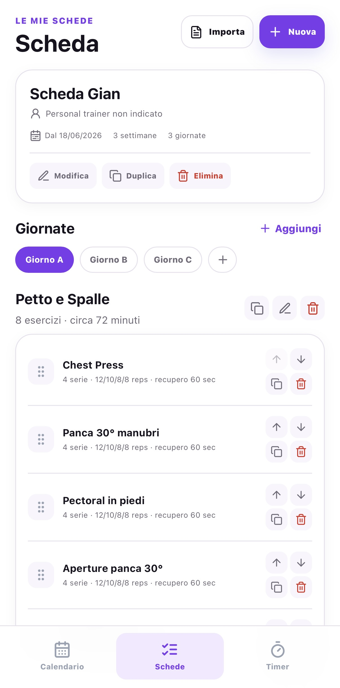
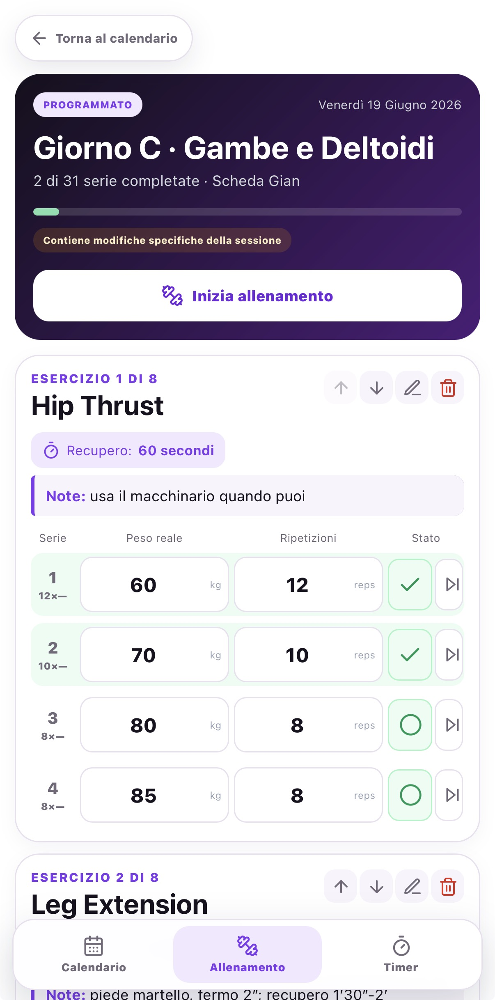
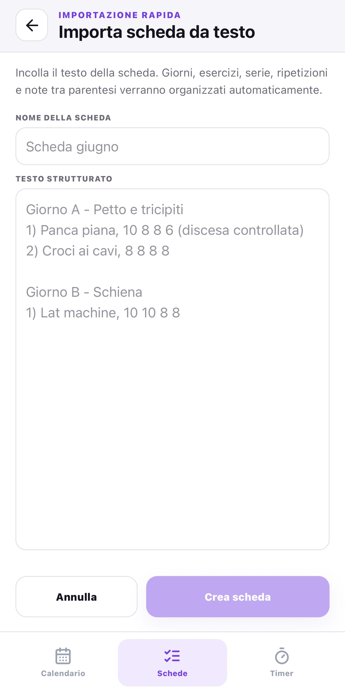
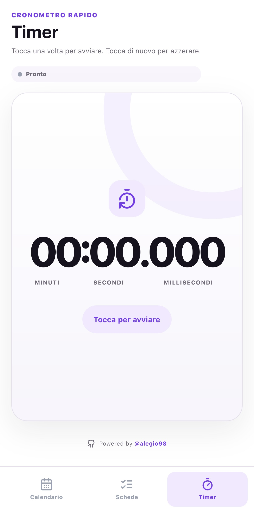

# Workout Planner

Workout Planner è una Progressive Web App mobile-first sviluppata con React, TypeScript e Vite.

Il progetto permette di creare e importare schede di allenamento, pianificare le sessioni nel calendario, registrare serie, ripetizioni e pesi e utilizzare un timer integrato.

L’applicazione segue un approccio **local-first**: i dati vengono salvati nel browser tramite IndexedDB e restano disponibili anche offline dopo il primo caricamento.

## Demo

https://alegio98.github.io/workout-planner-ale/

## Screenshot

<p align="center">
  
  
  
</p>

<p align="center">
  
  
</p>

## Stack tecnologico

- React
- TypeScript
- Vite
- Dexie
- IndexedDB
- CSS
- Service Worker
- Web App Manifest
- GitHub Actions
- GitHub Pages

## Architettura

L’applicazione è composta da tre livelli principali:

```text
Interfaccia React
      ↓
Logica applicativa TypeScript
      ↓
Dexie / IndexedDB
```

Non è presente un backend remoto.

Tutti i dati vengono salvati localmente nel browser dell’utente.

Il database IndexedDB utilizzato dall’app si chiama:

```text
WorkoutPlannerDB
```

Dexie viene utilizzato come wrapper TypeScript per semplificare lettura, scrittura e aggiornamento dei dati.

## Struttura del progetto

```text
workout-planner-ale/
├── public/
│   ├── icons/
│   ├── manifest.webmanifest
│   └── sw.js
├── src/
│   ├── components/
│   │   └── NumericInput.tsx
│   ├── App.tsx
│   ├── db.ts
│   ├── main.tsx
│   ├── planTextParser.ts
│   ├── styles.css
│   └── types.ts
├── index.html
├── package.json
├── package-lock.json
├── tsconfig.json
├── vite.config.ts
└── README.md
```

## Persistenza locale

I dati vengono salvati in IndexedDB.

Vantaggi:

- nessun backend necessario;
- latenza molto bassa;
- funzionamento offline;
- dati privati sul dispositivo;
- costi infrastrutturali ridotti.

Limiti:

- i dati non vengono sincronizzati tra dispositivi;
- cancellando i dati del browser si possono perdere le informazioni;
- non è presente un backup remoto;
- ogni browser mantiene il proprio archivio.

## Avvio in locale

Requisiti:

- Node.js 20 o superiore
- npm

Clona il repository:

```bash
git clone https://github.com/alegio98/workout-planner-ale.git
cd workout-planner-ale
```

Installa le dipendenze:

```bash
npm ci
```

Avvia il server di sviluppo:

```bash
npm run dev
```

Vite mostrerà un URL simile a:

```text
http://localhost:5173
```

## Script disponibili

```bash
npm run dev
```

Avvia l’app in modalità sviluppo.

```bash
npm run lint
```

Esegue il controllo TypeScript.

```bash
npm run build
```

Genera la build di produzione nella cartella `dist`.

```bash
npm run preview
```

## Autore

Sviluppato da Alessandro Giovannini.

- GitHub: https://github.com/alegio98
- Repository: https://github.com/alegio98/workout-planner-ale
- Demo: https://alegio98.github.io/workout-planner-ale/
